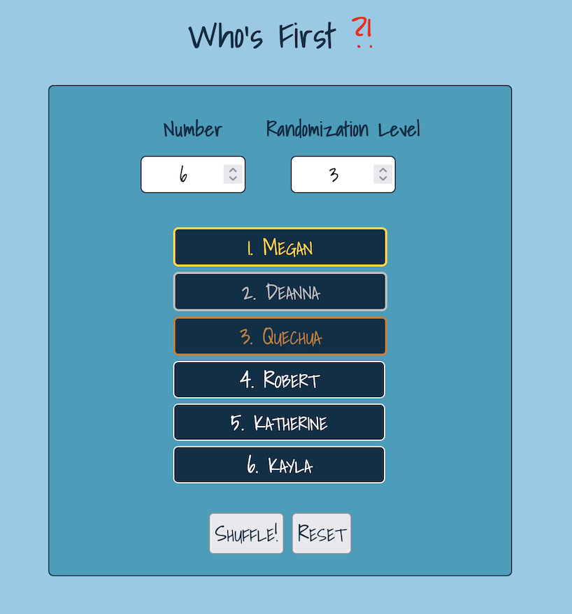

# Who's First !?

## Description

This is a simple web application that allows you to randomize the order of a list of children. You can add the names of the children and then shuffle them to see who goes first.

## How to Use

1. Open the `index.html` file in your web browser.
2. Enter the names of the children in the input fields provided.
3. Click the "Shuffle!" button or hit the "Enter" key on your keyboard to randomize the order of the children.
4. Click the "Reset" button to clear the list and start over.

## Technologies Used

- HTML
- CSS
- JavaScript

## License

This project is licensed under the MIT License.

## Example

